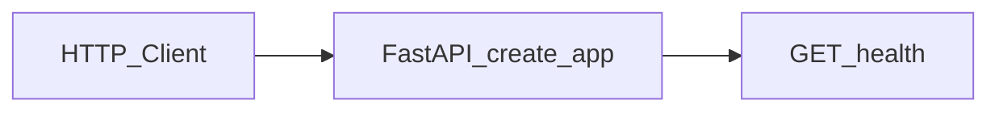

# Architecture

## Current (U0)

- Package: `specwright` under `apps/api/src/specwright/`
- Layers (empty stubs until later units): `domain/`, `application/`, `adapters/`, `api/`

## Target (U4+)

See charter `docs/charter/` — LangGraph supervisor invokes CrewAI; RAG over `data/kb/`; evals under `evals/`.

This file is updated as units land.
